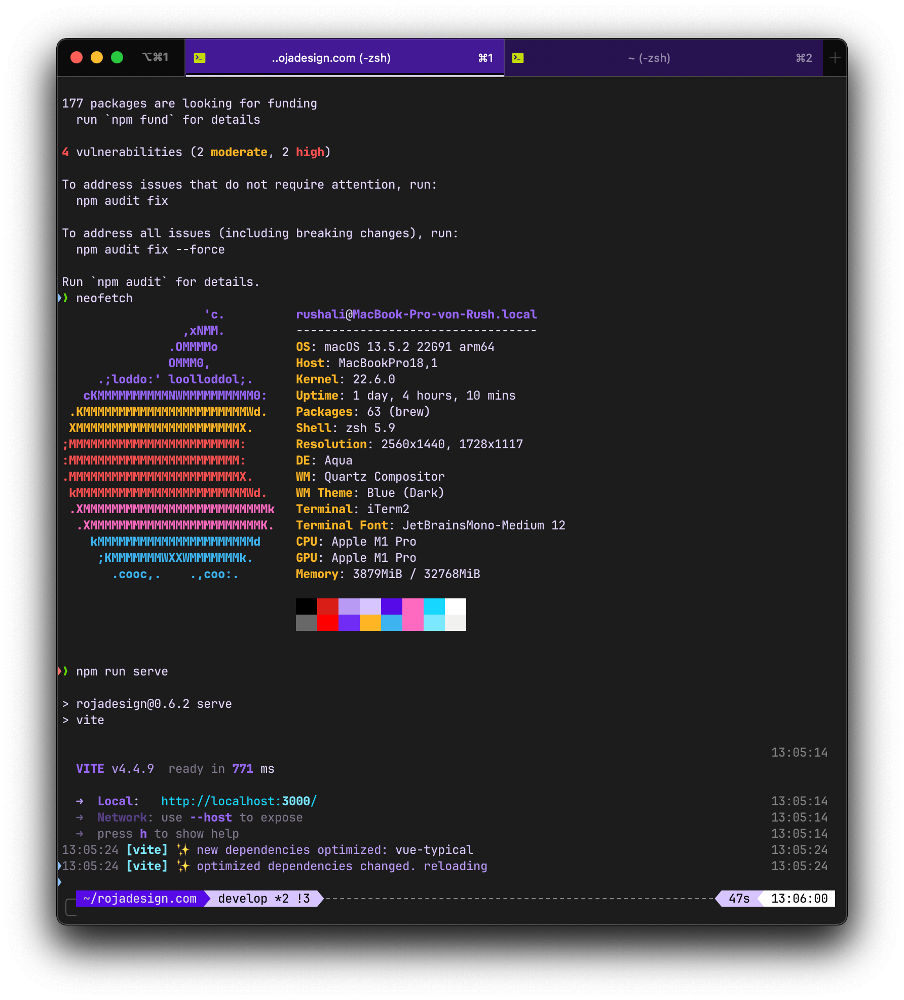
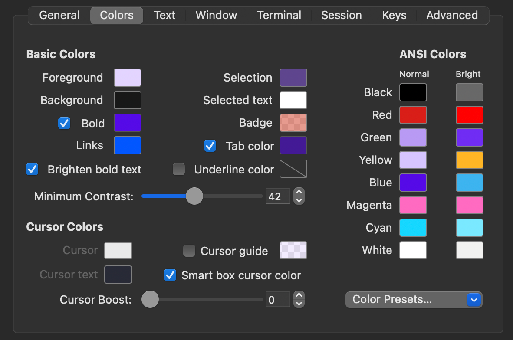

# iTerm2 – Violet Dream – Color Theme

This is a [iTerm2](https://iterm2.com/) color theme inspired by the [Violet Dream - VS Code Theme](https://github.com/AlexandreFPGoncalves/violet-dream).

### How To Use

- Launch iTerm 2. If not installed, get the latest version [here](https://iterm2.com/).
- Open **Preferences**
- Select **Profiles**
- Navigate to **Colors** tab
- Click on **Color Presets**
- Click on **Import**
- Select the `violet dream.itermcolors` file which you can download [here](./violet-dream.itermcolors).

### Example

### Color Settings

---

### Ressources & Inspirations

- [Violet Dream – VS Code Theme](https://github.com/AlexandreFPGoncalves/violet-dream) by [Alexandre Gonçalves](https://github.com/AlexandreFPGoncalves)
